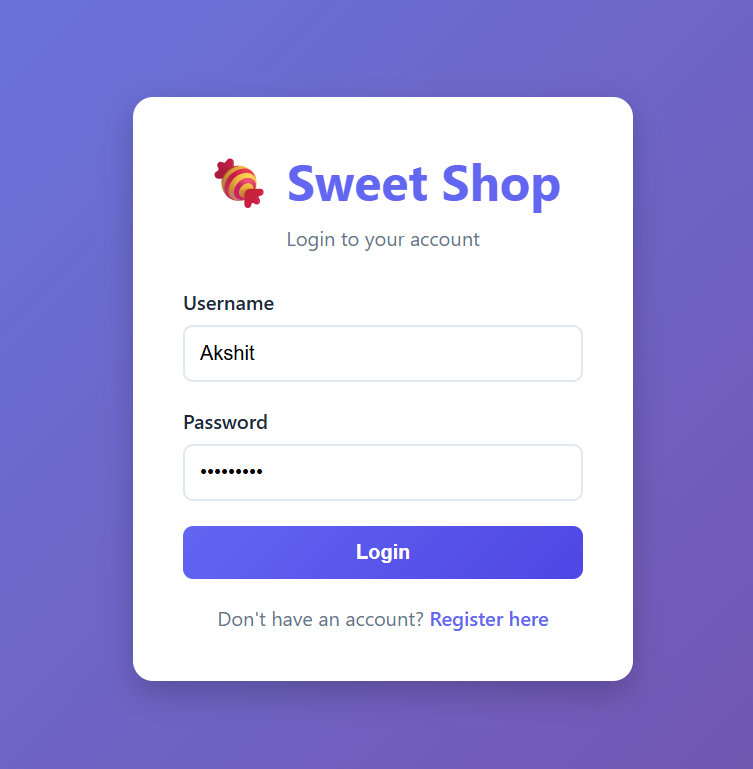
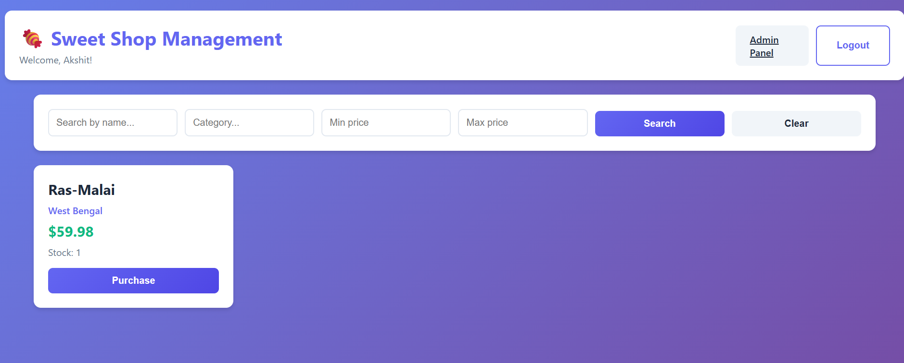
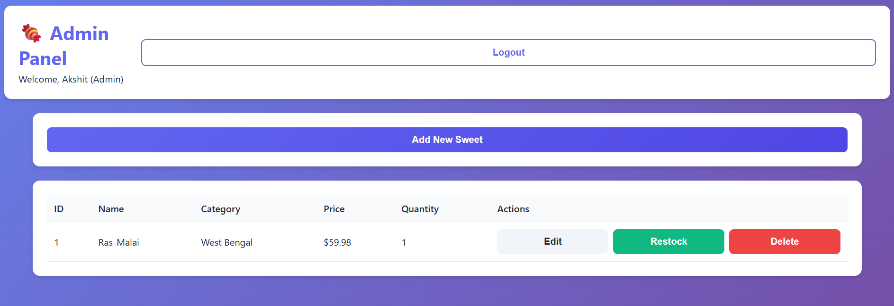

# 🍬 Sweet Shop Management System

A full-stack Sweet Shop Management System built with Spring Boot 3 (Java 17) and React, featuring JWT authentication, CRUD operations, inventory management, and a modern responsive UI.

## 📋 Table of Contents

- [Features](#features)
- [Technology Stack](#technology-stack)
- [Project Structure](#project-structure)
- [Setup Instructions](#setup-instructions)
- [API Documentation](#api-documentation)
- [Testing](#testing)
- [Deployment](#deployment)
- [Screenshots](#screenshots)
- [My AI Usage](#my-ai-usage)

## ✨ Features

### Backend (Spring Boot 3)
- ✅ User Registration & Login with JWT Authentication
- ✅ Sweet CRUD Operations (Create, Read, Update, Delete)
- ✅ Advanced Search (by name, category, price range)
- ✅ Inventory Management (Purchase & Restock)
- ✅ Role-based Access Control (User & Admin)
- ✅ RESTful API Design
- ✅ Database Integration (H2 & MySQL support)

### Frontend (React)
- ✅ Modern Single-Page Application (SPA)
- ✅ User Authentication (Login/Register)
- ✅ Sweet Dashboard with Search & Filter
- ✅ Purchase Functionality
- ✅ Admin Panel (Add, Edit, Delete, Restock)
- ✅ Responsive Design
- ✅ Real-time Updates

## 🛠 Technology Stack

### Backend
- **Framework:** Spring Boot 3.5.8
- **Language:** Java 17
- **Security:** Spring Security + JWT
- **Database:** H2 (default) / MySQL
- **Build Tool:** Maven
- **Testing:** JUnit, Spring Boot Test

### Frontend
- **Framework:** React 18
- **Build Tool:** Vite
- **HTTP Client:** Axios
- **Routing:** React Router DOM
- **Styling:** CSS3

## 📁 Project Structure

```
sweet-shop/
├── src/
│   ├── main/
│   │   ├── java/com/sweetshop/sweet_shop/
│   │   │   ├── auth/              # Authentication & JWT
│   │   │   ├── sweet/              # Sweet management
│   │   │   └── security/           # Security configuration
│   │   └── resources/
│   │       ├── static/             # Static files
│   │       └── application.properties
│   └── test/                       # Test files
├── frontend/                       # React application
│   ├── src/
│   │   ├── components/             # React components
│   │   └── utils/                  # Utilities
│   └── package.json
└── README.md
```

## 🚀 Setup Instructions

### Prerequisites

- **Java 17+**
- **Maven 3.6+**
- **Node.js 18+** (for frontend)
- **MySQL 8.0+** (optional, H2 works by default)

### Backend Setup

1. **Clone the repository:**
   ```bash
   git clone <repository-url>
   cd sweet-shop
   ```

2. **Build the project:**
   ```bash
   mvn clean install
   ```

3. **Run the application:**
   ```bash
   mvn spring-boot:run
   ```

   The backend will start on **http://localhost:8081**

4. **For MySQL (optional):**
   - Update `src/main/resources/application-mysql.properties`
   - Run with: `mvn spring-boot:run -Dspring-boot.run.profiles=mysql`

### Frontend Setup

1. **Navigate to frontend directory:**
   ```bash
   cd frontend
   ```

2. **Install dependencies:**
   ```bash
   npm install
   ```

3. **Start development server:**
   ```bash
   npm run dev
   ```

   The frontend will start on **http://localhost:3000**

4. **Build for production:**
   ```bash
   npm run build
   ```

## 📡 API Documentation

### Authentication Endpoints

#### Register User
```http
POST /api/auth/register
Content-Type: application/json

{
  "username": "john",
  "password": "password123",
  "role": "USER"
}
```

#### Login
```http
POST /api/auth/login
Content-Type: application/json

{
  "username": "john",
  "password": "password123"
}

Response:
{
  "token": "eyJhbGciOiJIUzI1NiIsInR5cCI6IkpXVCJ9...",
  "username": "john",
  "role": "USER",
  "message": "Login successful"
}
```

### Sweet Endpoints (Protected - Require JWT)

#### Get All Sweets
```http
GET /api/sweets
Authorization: Bearer <token>
```

#### Search Sweets
```http
GET /api/sweets/search?name=chocolate&category=candy&minPrice=1.00&maxPrice=10.00
Authorization: Bearer <token>
```

#### Get Sweet by ID
```http
GET /api/sweets/{id}
Authorization: Bearer <token>
```

#### Create Sweet (Admin Only)
```http
POST /api/sweets
Authorization: Bearer <token>
Content-Type: application/json

{
  "name": "Chocolate Bar",
  "category": "Chocolate",
  "price": 2.50,
  "quantity": 100
}
```

#### Update Sweet (Admin Only)
```http
PUT /api/sweets/{id}
Authorization: Bearer <token>
Content-Type: application/json

{
  "name": "Updated Name",
  "price": 3.00
}
```

#### Delete Sweet (Admin Only)
```http
DELETE /api/sweets/{id}
Authorization: Bearer <token>
```

### Inventory Endpoints

#### Purchase Sweet
```http
POST /api/sweets/{id}/purchase
Authorization: Bearer <token>
Content-Type: application/json

{
  "quantity": 2
}
```

#### Restock Sweet (Admin Only)
```http
POST /api/sweets/{id}/restock
Authorization: Bearer <token>
Content-Type: application/json

{
  "quantity": 50
}
```

## 🧪 Testing

### Running Tests

```bash
# Run all tests
mvn test

# Run with coverage
mvn test jacoco:report
```

### Test Coverage

- Unit tests for services
- Integration tests for controllers
- Security tests for authentication
- Repository tests for database operations

## 🚢 Deployment

### Railway (Recommended)

1. Push code to GitHub
2. Connect repository to Railway
3. Add MySQL database
4. Set environment variables:
   - `SPRING_PROFILES_ACTIVE=prod`
   - Database credentials (auto-configured)
5. Deploy!

See [RAILWAY_DEPLOY.md](RAILWAY_DEPLOY.md) for detailed instructions.

### Docker

```bash
# Build
docker build -t sweet-shop .

# Run
docker-compose -f docker-compose.prod.yml up
```

## 📸 Screenshots

### Login Page


### Dashboard


### Admin Panel


## 🤖 My AI Usage

### AI Tools Used

I used **GitHub Copilot** and **Claude (via Cursor)** extensively throughout this project to accelerate development and learn best practices.

### How I Used AI

#### 1. **Code Generation & Boilerplate**
- **GitHub Copilot:** Used for generating boilerplate code, especially for:
  - Spring Boot controller structures
  - React component templates
  - JWT authentication filter implementation
  - Database repository interfaces
  - Service layer method signatures

- **Claude (Cursor):** Used for:
  - Creating complete component implementations
  - Generating comprehensive test cases
  - Writing API documentation
  - Creating deployment configurations

#### 2. **Problem Solving & Debugging**
- **Error Resolution:** When encountering compilation errors or runtime issues, I used AI to:
  - Understand error messages and stack traces
  - Find solutions for JWT token validation issues
  - Resolve Spring Security configuration conflicts
  - Fix React state management problems

#### 3. **Code Review & Best Practices**
- **Code Quality:** AI helped me:
  - Refactor code to follow SOLID principles
  - Improve error handling patterns
  - Optimize database queries
  - Enhance security configurations

#### 4. **Documentation**
- **README Generation:** AI assisted in:
  - Structuring comprehensive documentation
  - Writing clear setup instructions
  - Creating API documentation examples
  - Generating deployment guides

#### 5. **Learning & Understanding**
- **Concept Clarification:** Used AI to:
  - Understand JWT token flow
  - Learn Spring Security filter chains
  - Grasp React hooks and state management
  - Understand RESTful API design patterns

### Specific Examples

1. **JWT Implementation:**
   - Used Copilot to generate the initial JWT service structure
   - Manually added custom claims and validation logic
   - AI helped debug token expiration issues

2. **React Components:**
   - Generated component templates with Copilot
   - Used Claude to create complete Dashboard and AdminPanel components
   - Manually integrated API calls and state management

3. **Security Configuration:**
   - AI suggested Spring Security filter chain configuration
   - Helped implement role-based access control
   - Assisted in JWT filter integration

4. **Database Queries:**
   - Generated repository search methods with AI
   - Optimized queries based on AI suggestions
   - Created complex search functionality with AI assistance

### Reflection on AI Impact

**Positive Impacts:**
- ⚡ **Speed:** Significantly accelerated development, especially for boilerplate code
- 🎓 **Learning:** Helped me understand complex concepts faster
- 🐛 **Debugging:** Quick solutions to common errors
- 📝 **Documentation:** Comprehensive documentation in less time

**Challenges:**
- 🔍 **Verification:** Had to carefully review AI-generated code
- 🎯 **Context:** Sometimes needed multiple iterations to get desired output
- 🧠 **Understanding:** Still needed to understand the code, not just copy it

**Best Practices I Followed:**
- ✅ Always reviewed and understood AI-generated code
- ✅ Tested thoroughly before committing
- ✅ Refactored AI code to match project standards
- ✅ Used AI as a learning tool, not just a code generator
- ✅ Documented AI usage transparently

### AI Co-authorship

All commits where AI was significantly used include co-authorship:

```
Co-authored-by: GitHub Copilot <copilot@users.noreply.github.com>
Co-authored-by: Claude <claude@anthropic.com>
```

## 📝 License

This project is open source and available under the MIT License.

## 👥 Contributors

- Primary Developer
- GitHub Copilot (AI Assistant)
- Claude (AI Assistant)

## 🙏 Acknowledgments

- Spring Boot team for excellent framework
- React team for amazing frontend library
- AI tools for accelerating development

---

**Built with ❤️ using Spring Boot, React, and AI assistance**
